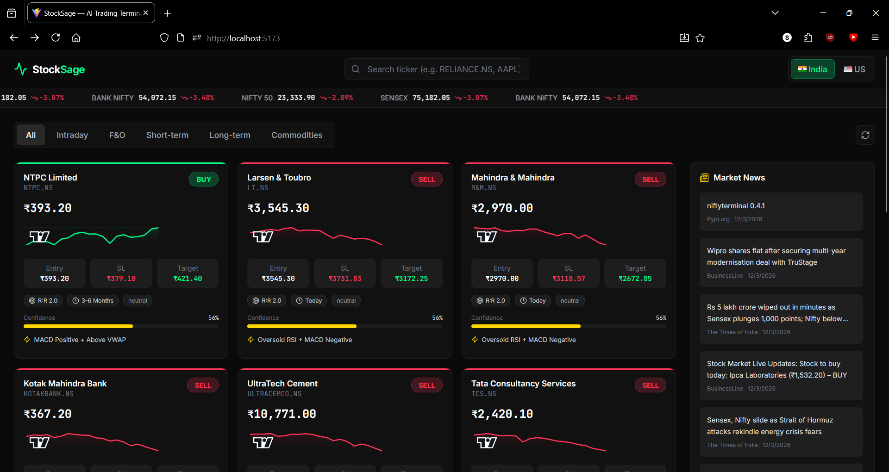
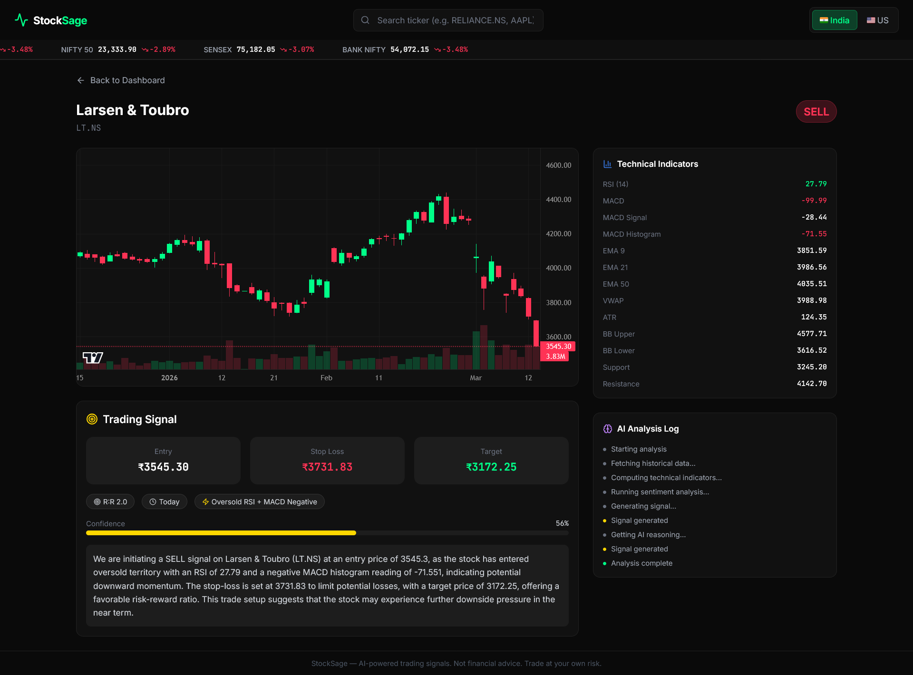

# StockSage — AI-Powered Trading Terminal

An AI-powered stock trading signal generator with a professional dark-themed UI. Five specialized AI agents work together to scan markets, analyze technicals, evaluate fundamentals, gauge sentiment, and produce actionable BUY / SELL / AVOID signals with entry, stop-loss, and target prices.


## Features

- **AI Agent Pipeline** — 5 specialized agents (Scanner → Technical Analyst → Fundamental Analyst → Sentiment Analyst → Signal Generator) collaborate to produce trading signals
- **Multi-Market** — Switch between Indian (NSE Nifty 50) and US (S&P 500 top 30) markets
- **5 Trade Categories** — Intraday, F&O (Futures & Options), Short-term, Long-term, Commodities
- **Smart Signal Types** — BUY, SELL (intraday/F&O/commodities only), and AVOID (delivery categories where short-selling isn't possible)
- **Professional Charts** — Candlestick + volume charts using TradingView's lightweight-charts
- **News Sentiment** — Keyword-based sentiment scoring on latest headlines
- **SSE Streaming** — Real-time streaming of analysis steps as each agent processes a stock
- **Auto Scan on Startup** — Pre-populates signals for both markets as soon as the server starts
- **Dark Theme** — TradingView-style UI with green/red/yellow accent colors

---

## How the AI Agents Work

StockSage uses a multi-agent pipeline where each agent handles a specific part of the analysis. On Windows, agents use the Groq SDK directly; on Linux/Mac, the full CrewAI orchestration framework is available.

### Agent 1: Market Scanner

> *"Expert market scanner identifying high-probability trading setups"*

The Scanner agent scans the full stock universe (50 NSE stocks or 30 S&P 500 stocks + 6 commodities) and scores each stock on 7 technical criteria:

| Criteria | Max Score | Logic |
|----------|-----------|-------|
| Volume spike | 3 | Current volume vs 20-day average (≥2x = 3, ≥1.5x = 2) |
| RSI extremes | 3 | RSI < 30 or > 70 (oversold/overbought) |
| EMA crossover | 3 | EMA 9/21 bullish or bearish crossover in last 2 bars |
| EMA trend alignment | 1 | Price > EMA9 > EMA21 (or inverse for bearish) |
| MACD histogram | 1 | Positive or negative momentum |
| Near support/resistance | 2 | Price within 3% of S/R levels |
| Bollinger Band touch | 2 | Price at upper or lower band |

Stocks scoring **≥ 2** are passed as candidates to the next stage. The top 15 are selected per market.

**Data source**: Bulk-downloads 3 months of daily OHLCV data via Yahoo Finance v8 chart API (direct HTTP, not the yfinance library) with 300ms throttling and multi-tier caching.

### Agent 2: Technical Analyst

> *"Senior TA with 15+ years across equities and derivatives"*

For each candidate stock, the Technical Analyst computes a full indicator suite:

- **Trend**: EMA 9, 21, 50, 200 + crossover detection
- **Momentum**: RSI (14), MACD (line, signal, histogram)
- **Volatility**: Bollinger Bands (20, 2σ), ATR (14)
- **Volume**: VWAP, volume ratio vs trailing average
- **Price Action**: Candlestick pattern detection (doji, hammer, engulfing)
- **Levels**: Pivot-based support & resistance (20-day window), 52-week high/low

Each factor adds to a bullish or bearish score:

| Factor | Bullish Score | Bearish Score |
|--------|--------------|---------------|
| EMA 9/21 crossover | +3 | +3 |
| EMA trend (9 > 21) | +1 | +1 |
| RSI < 30 (oversold) | +2 | — |
| RSI > 70 (overbought) | — | +2 |
| MACD histogram > 0 | +1 | +1 |
| Price > VWAP | +1 | +1 |
| Hammer / Bullish engulfing | +2 | — |
| Bearish engulfing | — | +2 |

**Signal**: BUY if `bullish ≥ bearish`, otherwise SELL. **Confidence**: `clamp(max_score × 12 + 20, 30, 95)`.

**Entry / SL / Target**: Calculated using ATR — SL at 1.5× ATR from entry, target at 3× ATR, yielding a fixed **1:2 risk-reward ratio**.

### Agent 3: Fundamental Analyst

> *"Equity researcher evaluating valuations and financial health"*

Evaluates company fundamentals when available:
- **Valuation**: P/E ratio, P/B ratio
- **Growth**: EPS, revenue trends
- **Quality**: ROE, profit margins, debt-to-equity ratio
- **Ownership**: Promoter holding (for Indian stocks)

Provides a strength score (1-10) and one-line summary. Skipped for intraday and F&O trades where fundamentals are less relevant.

### Agent 4: Sentiment Analyst

> *"Market sentiment specialist scanning financial news"*

Analyzes the latest news headlines for each stock:
- Fetches up to 5 recent headlines via NewsAPI
- Scores sentiment using keyword matching (20 positive words like "surge", "rally", "bullish" vs 18 negative words like "crash", "decline", "bearish")
- Outputs a sentiment score from **-1.0** (very negative) to **+1.0** (very positive)
- Labels: `positive` (> 0.1), `negative` (< -0.1), or `neutral`
- Identifies the most impactful headline for display

### Agent 5: Signal Generator (Chief)

> *"Head of Trading at a professional prop desk — final call on every trade"*

The Chief Signal Generator aggregates all outputs and produces the final trading signal:

1. **Categorization** — Assigns each stock to a category based on its indicator profile:
   - **Intraday**: ATR > 3% of price (high daily volatility for day-trading)
   - **F&O**: RSI < 30 or > 70 (strong directional conviction for derivatives)
   - **Long-term**: All EMAs aligned (price > EMA9 > EMA21 > EMA50, or inverse)
   - **Short-term**: Everything else (swing / positional trades)
   - **Commodities**: Commodity tickers (gold, silver, oil, etc.)

2. **Signal safety** — In delivery-based categories (short-term, long-term), SELL signals are converted to **AVOID** since you can't short-sell in the cash market. SELL is only shown for intraday, F&O, and commodities.

3. **LLM reasoning** — Optionally generates a 2-3 sentence professional trading explanation using **LLaMA 4 Scout 17B** via Groq (temperature 0.3). Fast scans skip LLM for speed; detailed single-stock analysis includes it.

4. **Sorting** — Results are sorted by priority: BUY first, then SELL, then AVOID, each sub-sorted by confidence descending.

---

## Tech Stack

| Layer | Technology |
|-------|-----------|
| Backend | Python 3.11+, FastAPI, Groq SDK (LLaMA 4 Scout 17B) |
| Data | Yahoo Finance v8 chart API (direct HTTP), NewsAPI |
| Analysis | ta (technical analysis), pandas, numpy |
| Frontend | React 18, Vite 5, Tailwind CSS v3, lightweight-charts v4 |
| Streaming | SSE (analysis step streaming) |
| Animations | Framer Motion, Lucide React icons |
| Caching | cachetools TTLCache (prices 5min, history 1hr, info 24hr) |

## Project Structure

```
StockSage/
├── run.py                          # Quick-start launcher
├── backend/
│   ├── main.py                     # FastAPI app, REST + SSE endpoints
│   ├── crew.py                     # Agent pipeline orchestration
│   ├── agents/                     # AI agent definitions
│   │   ├── scanner_agent.py        # Market Scanner agent
│   │   ├── technical_analyst.py    # Technical Analyst agent
│   │   ├── fundamental_analyst.py  # Fundamental Analyst agent
│   │   ├── sentiment_analyst.py    # Sentiment Analyst agent
│   │   └── signal_generator.py     # Chief Signal Generator agent
│   ├── tools/                      # Data fetching & analysis tools
│   │   ├── yfinance_tools.py       # Yahoo Finance v8 API client
│   │   ├── indicator_tools.py      # Technical indicator computation
│   │   ├── sentiment_tools.py      # News fetching & sentiment scoring
│   │   └── market_scanner.py       # Stock scoring & candidate selection
│   ├── data/                       # Stock universe definitions
│   │   ├── nse_stocks.py           # Nifty 50 tickers + NSE indices
│   │   └── nyse_stocks.py          # S&P 500 top 30 + commodities + US indices
│   └── requirements.txt
├── frontend/
│   ├── src/
│   │   ├── App.jsx                 # Router setup
│   │   ├── api.js                  # API client functions
│   │   ├── pages/
│   │   │   ├── Home.jsx            # Dashboard with signal cards
│   │   │   └── StockDetail.jsx     # Detailed stock analysis page
│   │   └── components/
│   │       ├── SuggestionCard.jsx  # Signal card (BUY/SELL/AVOID)
│   │       ├── MiniChart.jsx       # Sparkline chart
│   │       ├── CategoryTabs.jsx    # Category filter tabs
│   │       ├── MarketToggle.jsx    # India/US market switch
│   │       ├── SearchBar.jsx       # Stock search
│   │       ├── LivePriceTicker.jsx # Index price ticker
│   │       └── NewsTickerFeed.jsx  # Scrolling news feed
│   ├── package.json
│   ├── vite.config.js
│   └── tailwind.config.js
└── .env
```

---

## Setup

### Prerequisites

- Python 3.11+
- Node.js 18+
- Groq API Key (free at [console.groq.com](https://console.groq.com))
- NewsAPI Key (optional, free at [newsapi.org](https://newsapi.org))

### 1. Clone & Configure

```bash
git clone https://github.com/Zentise/StockSage.git
cd StockSage
```

Create a `.env` file in the project root:

```env
GROQ_API_KEY=your_groq_api_key_here
NEWS_API_KEY=your_newsapi_key_here   # optional
```

### 2. Backend Setup

```bash
cd backend
python -m venv .venv

# Windows
.venv\Scripts\activate

# Mac/Linux
source .venv/bin/activate

pip install -r requirements.txt
```

> **Note**: On Linux/Mac you can optionally install CrewAI for full agent orchestration:
> ```bash
> pip install crewai==0.80.0 crewai-tools==0.14.0
> ```
> On Windows the app automatically falls back to the Groq SDK (same results, just a different execution path).

### 3. Frontend Setup

```bash
cd frontend
npm install
```

### 4. Run

**Option A — Quick start** (from project root):
```bash
python run.py
```

**Option B — Manual** (two terminals):

```bash
# Terminal 1 — Backend (from project root, NOT from backend/)
uvicorn backend.main:app --port 8000 --reload

# Terminal 2 — Frontend
cd frontend
npm run dev
```

Open [http://localhost:5173](http://localhost:5173) in your browser.

The server runs a startup scan automatically — signals should appear within ~60 seconds.

---

## API Endpoints

| Method | Endpoint | Description |
|--------|----------|-------------|
| GET | `/health` | Health check |
| GET | `/suggestions?market=india&category=all` | Cached trading signals |
| GET | `/scan?market=india` | Trigger a fresh market scan |
| GET | `/analyze/{ticker}?market=india` | Full analysis for a single stock |
| GET | `/chart/{ticker}?period=3mo&interval=1d` | OHLCV chart data |
| GET | `/indices?market=india` | Market index prices |
| GET | `/news?market=india` | Latest market news |
| GET | `/stream/analyze/{ticker}?market=india` | SSE: stream analysis steps live |

### Query Parameters

- `market`: `india` or `us`
- `category`: `all`, `intraday`, `fno`, `short_term`, `long_term`, `commodities`

## Signal Format

```json
{
  "ticker": "RELIANCE.NS",
  "name": "Reliance Industries",
  "category": "intraday",
  "signal": "BUY",
  "entry": 2450.50,
  "sl": 2420.00,
  "target": 2510.00,
  "rr_ratio": "2.0",
  "confidence": 82,
  "strategy": "EMA 9/21 Crossover + Above VWAP",
  "reasoning": "BUY signal based on EMA 9/21 Crossover + Above VWAP.",
  "sentiment": "positive",
  "top_headline": "Reliance Q3 profits beat estimates by 12%",
  "timeframe": "Today"
}
```

### Signal Types

| Signal | Where it appears | Meaning |
|--------|-----------------|---------|
| **BUY** | All categories | Go long — buy the stock/contract |
| **SELL** | Intraday, F&O, Commodities | Go short — short-sell or buy puts |
| **AVOID** | Short-term, Long-term | Bearish outlook but can't short in cash market — stay away |

---

## Screenshots


Home Dashboard with all the listings


stock page with Candle Stick Graph, Technical Indicators and Trading Signal

---

## Disclaimer

- This project is for **educational and informational purposes only**
- Not financial advice — trade at your own risk
- AI signals are based on technical analysis and sentiment heuristics, not guaranteed
- Market data from Yahoo Finance may have delays; this is not a real-time trading system
- Groq free tier has rate limits — the scanner throttles requests to stay within limits

## License

MIT
